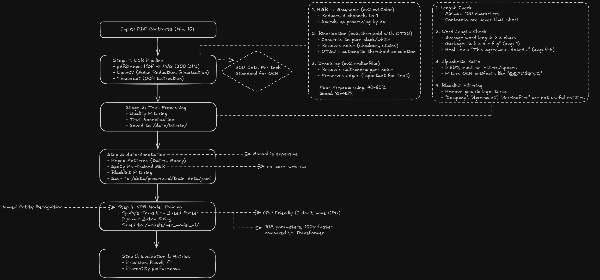

# LexiScan
A NLP based automated entity extraction from legal contracts using Optional Character Recognition (OCR) and Named Entity Recognition (NER).



## What It Does
Extracts key information from PDF contracts:
- Party names
- Dates (effective, expiration)
- Amounts and financial terms
- Jurisdiction and legal terms

## Installation

```bash
# Clone repo
git clone https://github.com/ajitashwath/lexi-scan.git
cd lexi-scan

# Install dependencies
pip install -r requirements.txt
python -m spacy download en_core_web_sm

# Install Tesseract OCR (system dependency)
# Ubuntu: sudo apt-get install tesseract-ocr poppler-utils
# macOS: brew install tesseract poppler
# Windows: Download from https://github.com/UB-Mannheim/tesseract/wiki
```

## Quick Start
```bash
# Automated setup
python complete.py

# Or manual steps:
# 1. Add PDFs to data/raw/
# 2. python src/preprocessing/run_batch.py
# 3. python scripts/auto_annotate.py
# 4. python src/models/train_ner.py
```

## Usage

### Command Line
```bash
python end_test.py path/to/contract.pdf
```

### Python API
```python
import spacy
from src.preprocessing.ocr_engine import extract_text_from_pdf
from src.postprocessing.rule_engine import apply_rules, deduplicate_entities

nlp = spacy.load("models/ner_model_v1")
text = extract_text_from_pdf("contract.pdf")
doc = nlp(text)
entities = [(ent.text, ent.label_) for ent in doc.ents]
cleaned = apply_rules(entities)
final = deduplicate_entities(cleaned)
```

### REST API
```bash
# Start server
python api/main.py

# Extract entities
curl -X POST "http://localhost:8000/extract" \
  -F "file=@contract.pdf"
```

## Docker

```bash
# Build and run
docker-compose up -d

# Test
curl http://localhost:8000/health
```

## Project Structure

```
lexiscan/
├── api/                    # FastAPI endpoints
├── data/
│   ├── raw/               # Input PDFs
│   ├── interim/           # OCR output
│   └── processed/         # Training data
├── models/                # Trained NER models
├── src/
│   ├── preprocessing/     # OCR pipeline
│   ├── models/           # NER training
│   └── postprocessing/   # Rule engine
└── tests/                # Test suite
```

## Training

```bash
# Evaluate model
python src/models/evaluate_model.py

# Retrain with more data
# 1. Add more PDFs to data/raw/
# 2. python src/preprocessing/run_batch.py
# 3. python scripts/auto_annotate.py
# 4. python src/models/train_ner.py
```

## Testing

```bash
pytest tests/ -v
```

## Troubleshooting
**OCR fails**: Check Tesseract installation with `tesseract --version`
**Model not found**: Run `python src/models/train_ner.py`
**Low accuracy**: Add more training PDFs (target: 50+)
